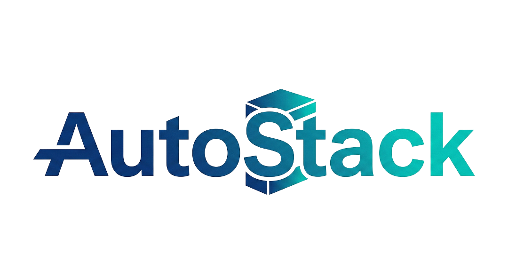
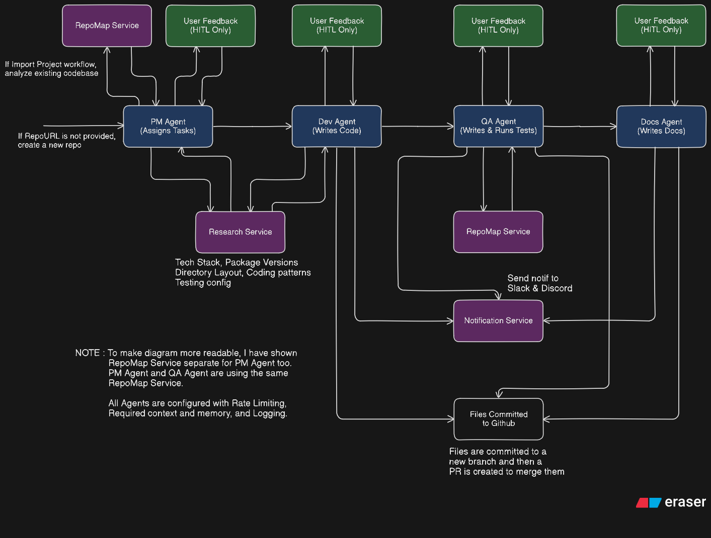
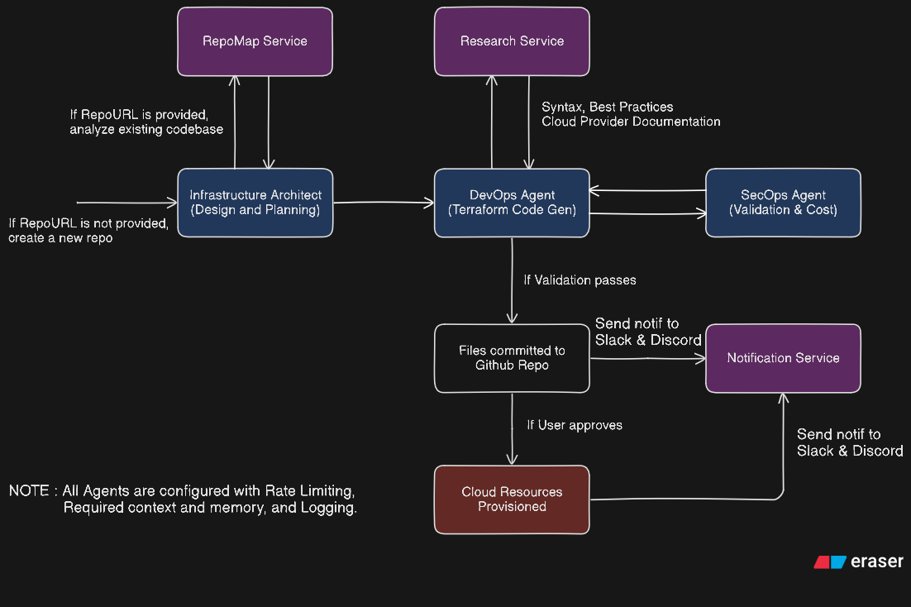

# 

**AutoStack** is the ultimate AI-powered autonomous software factory. It combines specialized AI agents, LangGraph orchestration, and cloud-native infrastructure to help you **Plan**, **Build**, and **Deploy** applications and cloud environments - all without writing a single line of code by yourself.

[](https://vimeo.com/1160646228?share=copy&fl=sv&fe=ci)

## The 2 Core Features

### 1. AutoStack Core (Software Development)
A comprehensive **4-Agent Pipeline** that acts as your dedicated engineering team. It operates in two powerful contexts:

*   **New Project Mode**: Takes a high-level idea (e.g., "Build a Notes app") and generates a complete, tested codebase from scratch.
*   **Existing Repo Mode**: Imports your GitHub repository, analyzes existing code, and implements new features or fixes bugs automatically via Pull Requests.

**How it works:**
*   **Autonomous Planning**: The **Project Manager** analyzes your request, researches best practices via **Tavily**, and creates a detailed technical specification and task list.
*   **Implementation**: The **Developer** agent writes production-ready code, managing the file structure and dependencies, while handling all Git operations (branching, committing, PRs).
*   **Self-Healing Quality Assurance**: The **QA** agent reviews every line of code, generates comprehensive unit tests, and automatically requests fixes if bugs are detected—ensuring only passing code is merged.
*   **Living Documentation**: The **Documentation** agent keeps your README and API docs in sync with the codebase in real-time.

It features **Automatic Mode** for hands-off execution or **Human-in-the-Loop** mode where you provide feedback to guide the agents.



### 2. AutoStack Infra (Cloud Provisioning)
A specialized **3-Agent Triad** that delivers enterprise-grade cloud environments on **Microsoft Azure**.

*   **Intelligent Architecture**: The **Infra Architect** analyzes your application's needs (or existing repo) to design a secure, scalable cloud topology, selecting the optimal services.
*   **Infrastructure as Code (IaC)**: The **DevOps** agent generates clean, modular **Terraform** code, handling state management and resource dependencies automatically.
*   **Security & FinOps**: The **SecOps** agent validates every resource against industry standards using **Checkov** to prevent vulnerabilities and estimates monthly costs via **Infracost** before deployment.



---

### Technology Stack

| Domain | Technologies |
|--------|-------------|
| **Backend** | **FastAPI**, **LangChain**, **LangGraph** (Orchestration) |
| **Frontend** | **Next.js**, **TailwindCSS** |
| **AI / LLM** | **Groq** (Llama 3 & Qwen), **OpenRouter** (Qwen) |
| **Database** | **PostgreSQL**, **ChromaDB** |
| **Cloud** | **Microsoft Azure** |
| **Infrastructure** | **Terraform** |
| **Tools** | **GitHub API** (Repo Ops), **Checkov** (Security), **Infracost** (FinOps), **Apprise** (Notifications), **Tavily** (Research), **RepoMap** (Code Analysis) |

---

## Core Services

| Service | Role |
|-------|------|
| **Research** | Uses **Tavily AI** to research the web for up-to-date tech stacks, package versions, and best practices. |
| **Code Analysis** | Uses **RepoMap** to generate high-level semantic maps of existing codebases for accurate context. |
| **Notifications** | Sends real-time workflow updates and provisioning alerts via **Slack** and **Discord** using Apprise. |
| **Git Operations** | Automated **GitHub** client for branching, committing, and Pull Request management. |

---

## Agent Breakdown

### Software Development Agents
| Agent | Role |
|-------|------|
| **Project Manager** | Analyzes requirements, breaks down tasks, and orchestrates the team workflow. |
| **Developer** | Writes high-quality, typed code and manages GitHub operations (Branches/Commits). |
| **QA** | Reviews code, generates unit tests, and validates implementations against requirements. |
| **Documentation** | Generates comprehensive READMEs, API documentation, and user guides. |

### Infrastructure Provisioning Agents
| Agent | Role |
|-------|------|
| **Infra Architect** | Designs cloud architecture on Azure based on requirements and best practices. |
| **DevOps** | Generates Terraform code, applies configurations, and manages state. |
| **SecOps** | Validates infrastructure security (Checkov) and estimates costs (Infracost). |

---

## Quick Start

### Prerequisites
- Python 3.11+
- Node.js (v18+)
- **uv** (Python package manager) - Install: `pip install uv`
- PostgreSQL database (local or remote)
- Azure Subscription (for Infra mode)

### Running the Project
The project consists of a Python backend and a Next.js frontend. You will need to run them in separate terminals.

#### Terminal 1: Backend (FastAPI)
```bash
# 1. Install Dependencies
uv sync

# 2. Configure Environment
cp .env.example .env
# Edit .env with your API Keys 

# 3. Run Migrations
uv run alembic upgrade head

# 4. Start Server
uv run uvicorn api.main:app --reload
```
*   **API Server**: http://localhost:8000
*   **API Docs**: http://localhost:8000/docs

#### Terminal 2: Frontend (Next.js)
```bash
cd app
npm install
npm run dev
```
*   **Dashboard**: http://localhost:3000
